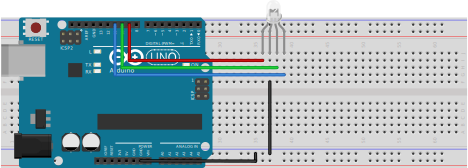

# Arduino RGB Led Node.js Example

A example for serial communication with Arduino and Node.js to control a Common Cathode RGB LED using an Arduino and [Node SerialPort](https://github.com/node-serialport/node-serialport).

## Connecting the RGB Led to Arduino
The project is a web application to control a common cathode RGB LED using Arduino and [Node SerialPort](https://github.com/node-serialport/node-serialport). The server uses the [Express](https://github.com/expressjs/express) framework and [Socket.io](https://github.com/socketio/socket.io) to transmit data in real time between the server and the client.

### Led Connection
The led connection in the hardware is

| Color   | Pin |
| ------- | --- |
| Red     | 9   |
| Green   | 10  |
| Blue    | 11  |
| Cathode | GND |

### Example Circuit

  

## Incoming data format

The format that is used to configure the colors is `R255G255B255\n`.

## Running the project locally

1.  `git clone https://github.com/franciscodelahoz/arduino-rgb-led-nodejs-example`
2.  `cd arduino-rgb-led-nodejs-example`
3.  `Upload the RGB_LED.ino code to the Arduino from the arduino folder`
4.  `npm i`
5.  `npm start`
